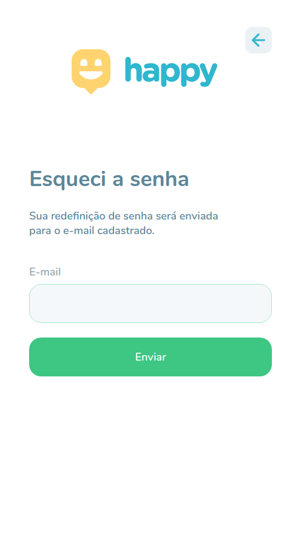

  

 

# :memo: Sobre

App developed at the event promoted by Rocketseat called next level week, where a complete application is developed.

This is an app created to bring people closer to orphanages making kids more happier and it's currently under development.

I'm using this project to improve my git knowledge, creating a real project flow with git flow.

# :cool: 2.0 version

Some screenshots of version 2.0

The following features have been implemented:

- Login
- Dashboard
- Responsiveness

  

  
  
  
  

  

# :rocket: Technologies
This project was developed with the following technologies:

- ReactJS
- Typescript
- styled-components
- Eslint and Prettier
- react-router-dom
- React-Leaflet

---
Made with :purple_heart: by Geovani Cavalcante :wave: [Get in touch!](https://www.linkedin.com/in/geovani-cv/)

